# Testing screenshots of Workout server

USER - REGISTER
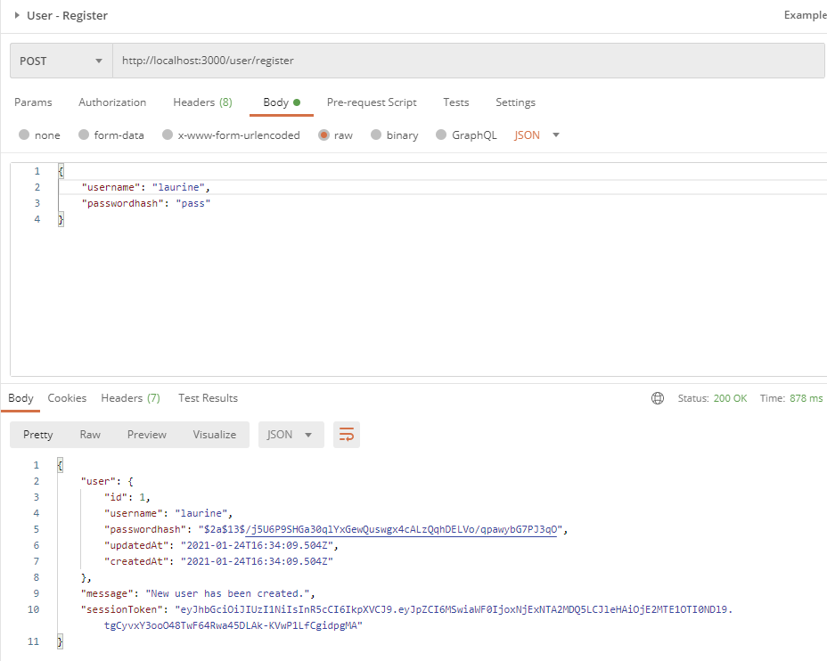

USER - LOGIN
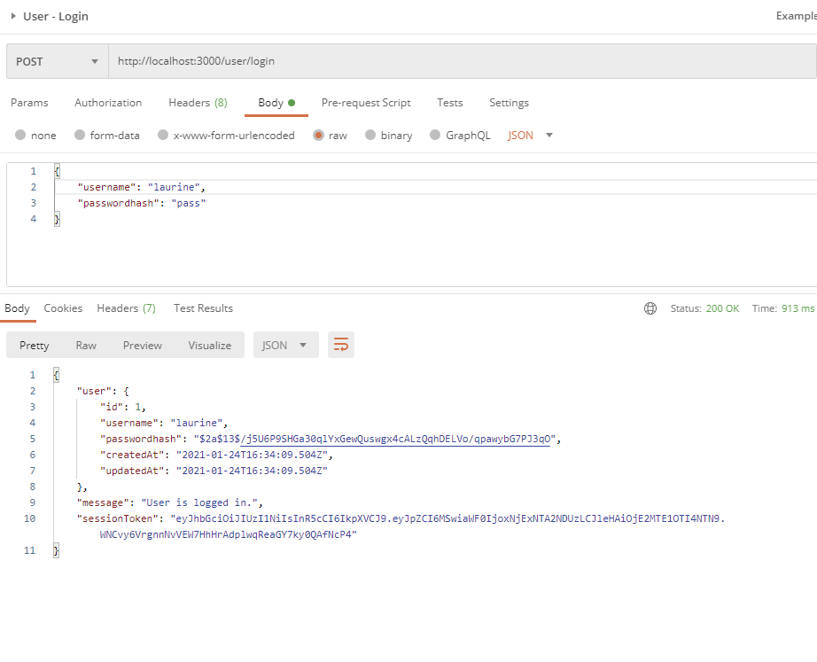

LOG - CREATE
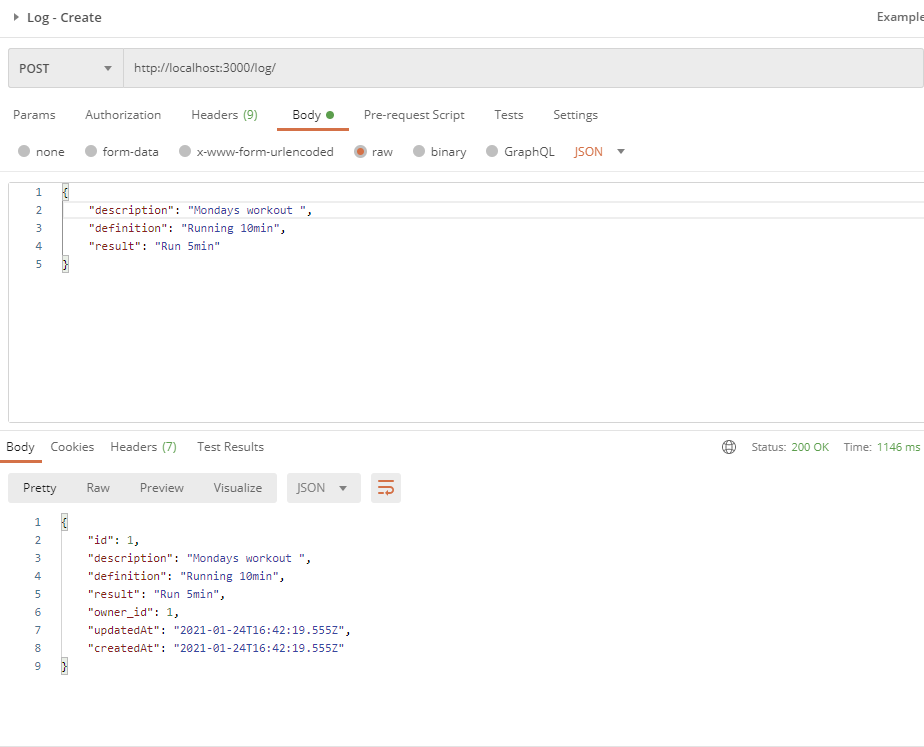

LOG - GET ALL
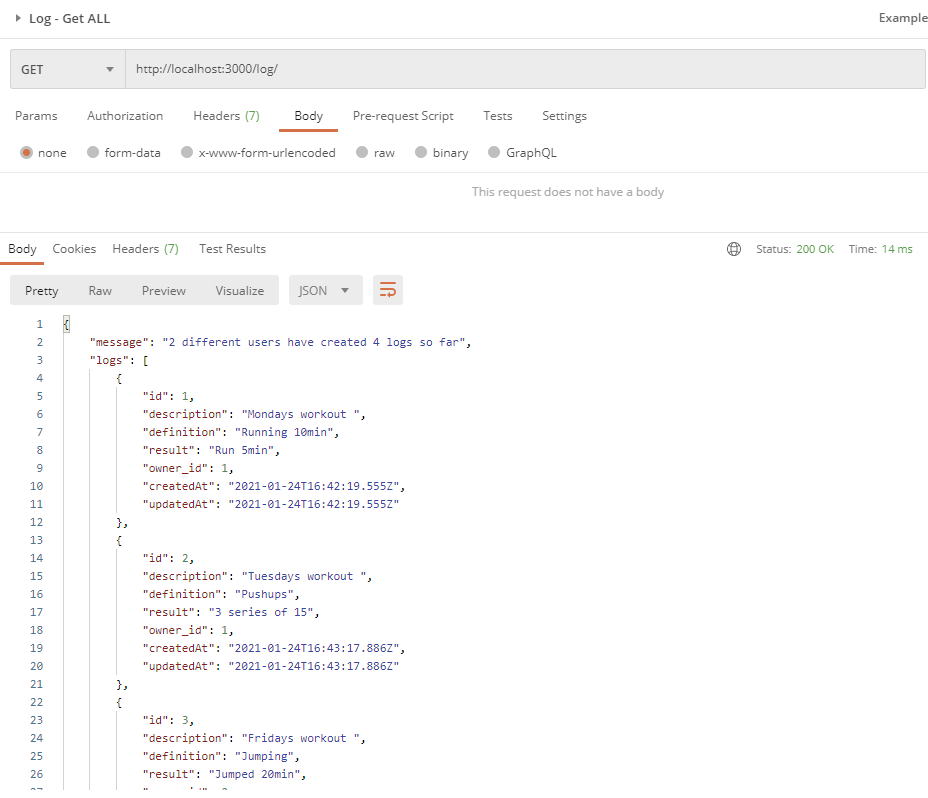

LOG - GET by ID
from User 1
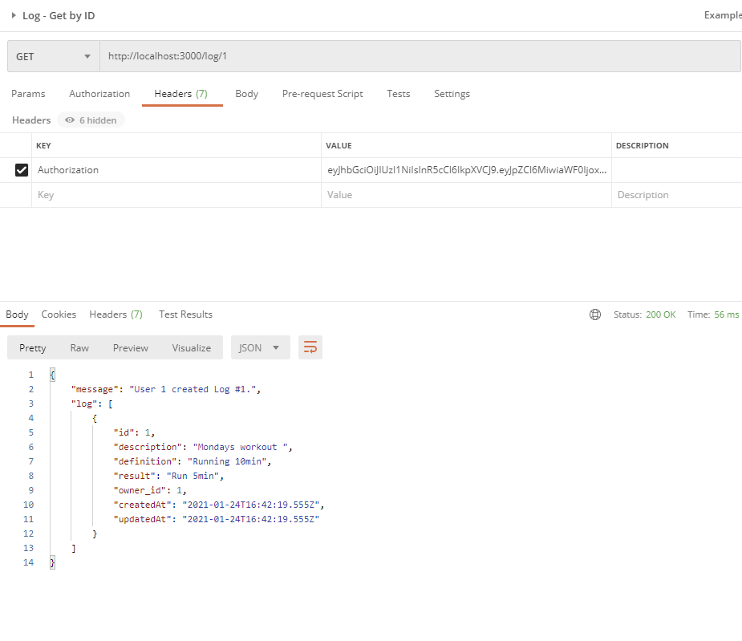
from User 2
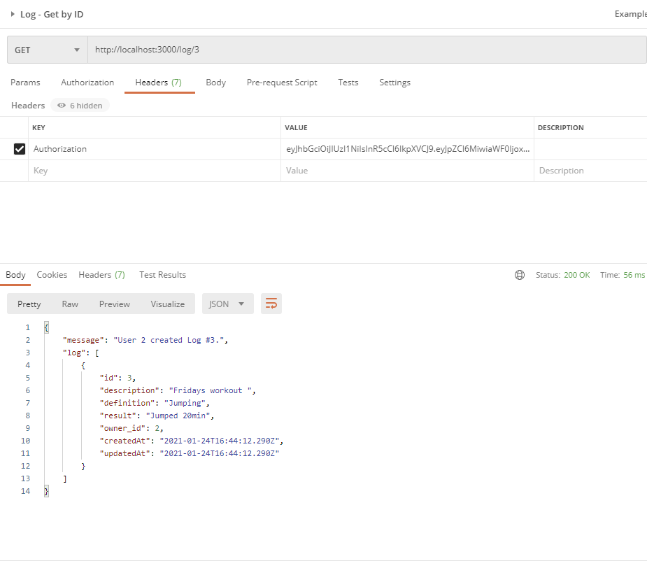

LOG - UPDATE
logged as user 2 (authorized to modify logs 3 and 4)
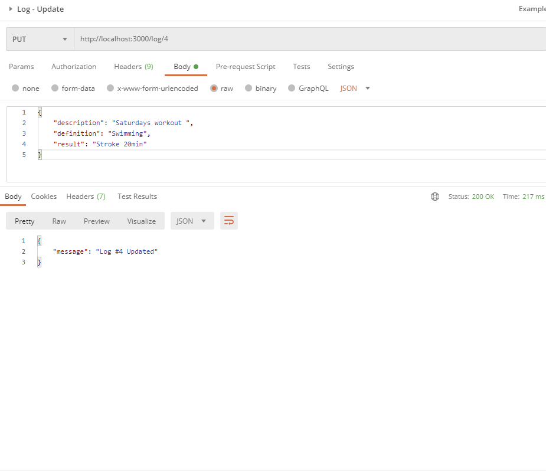
see update with Get by Id
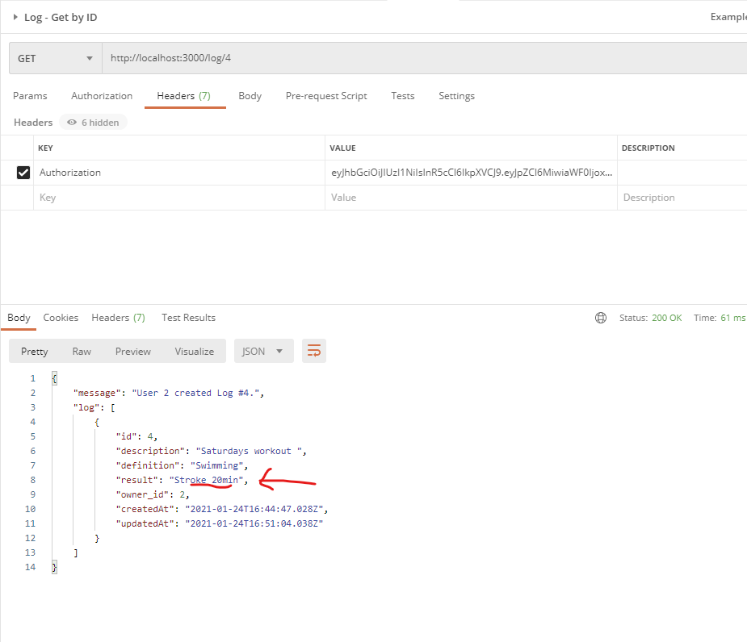

logged as user 2 (cannot modify logs 1 and 2)
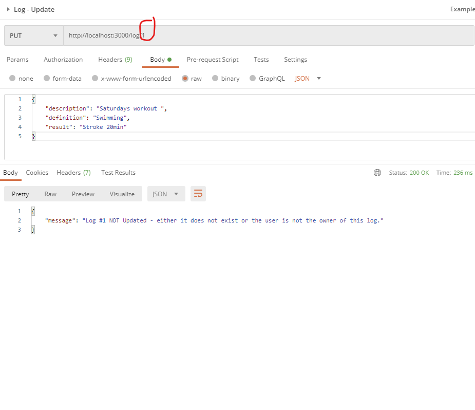
log does not exist
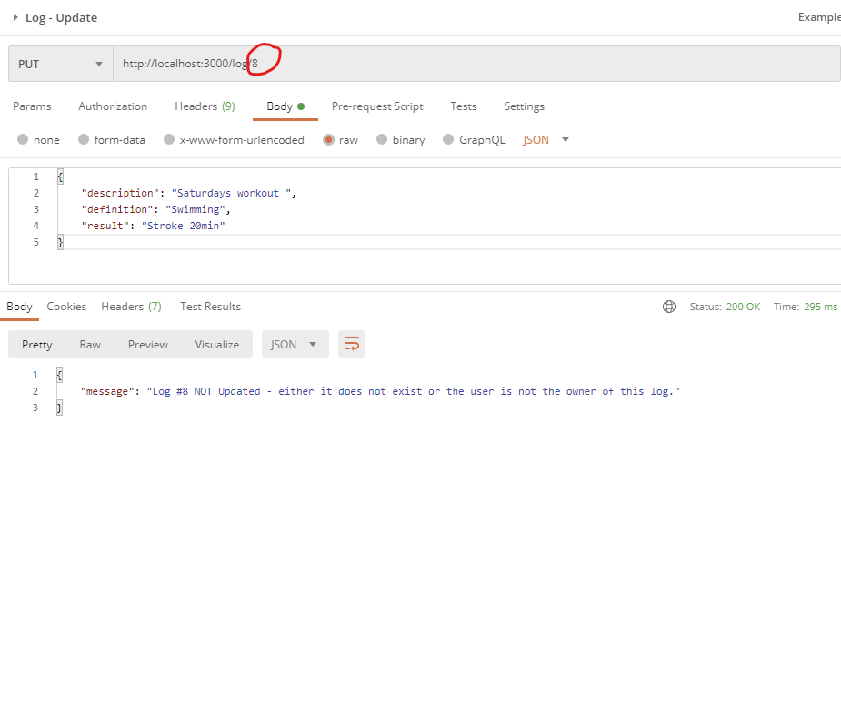

LOG - DELETE
logged as user 2 (authorized to delete logs 3 and 4)
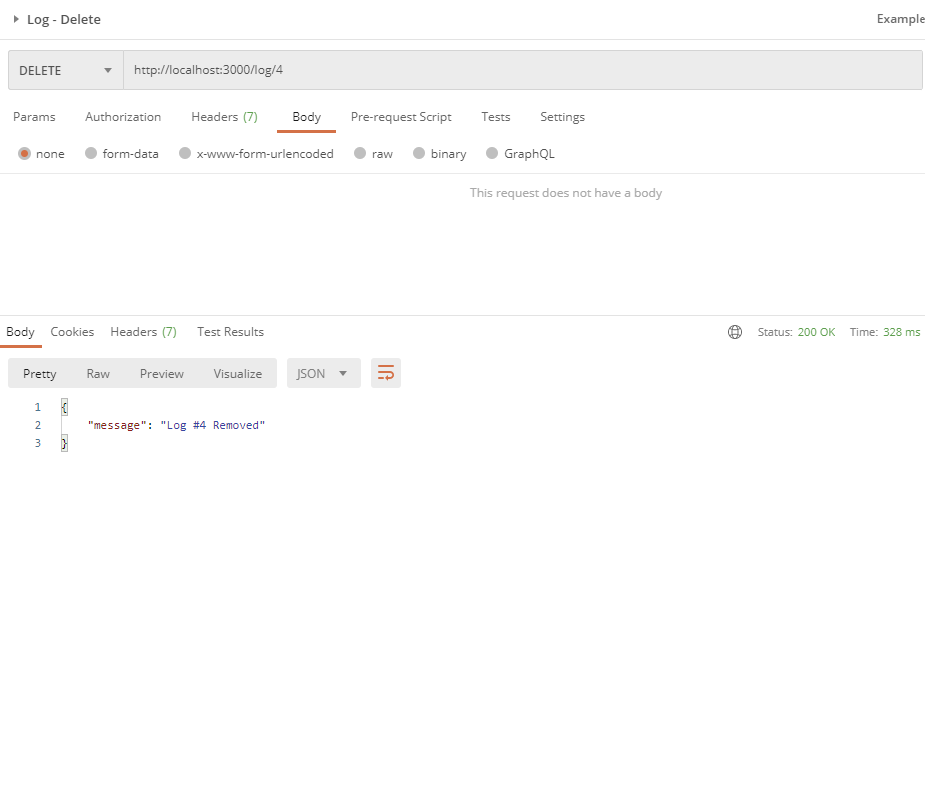
see deletion with Get All
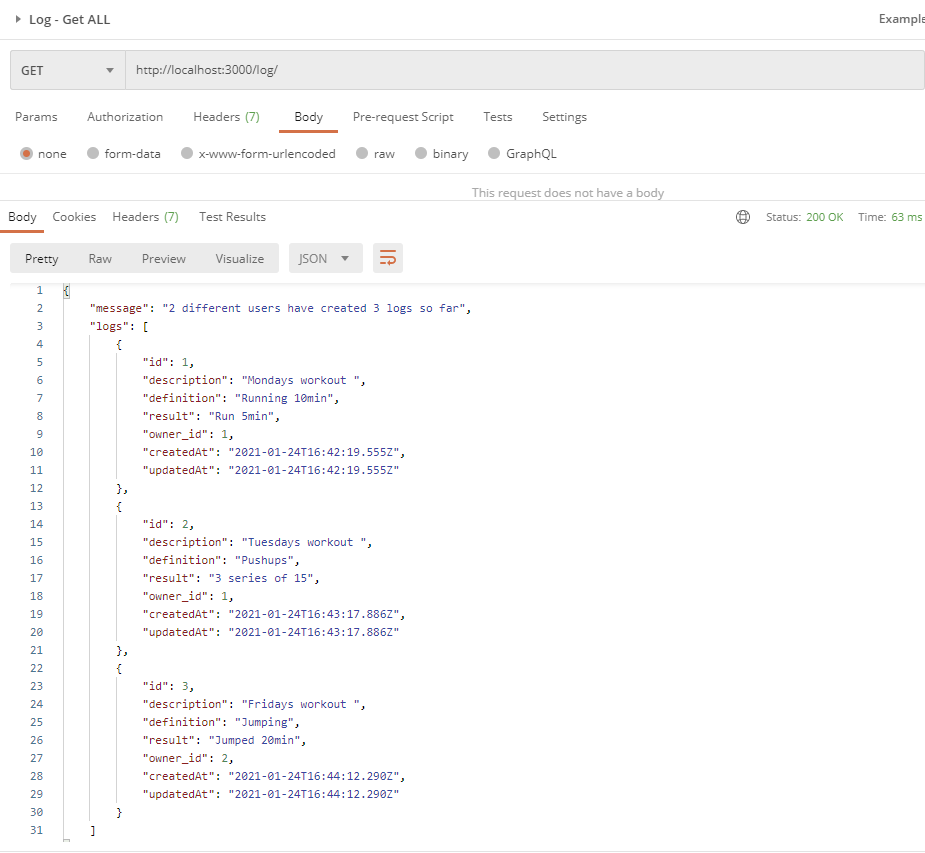

logged as user 2 (cannot delete logs 1 and 2)
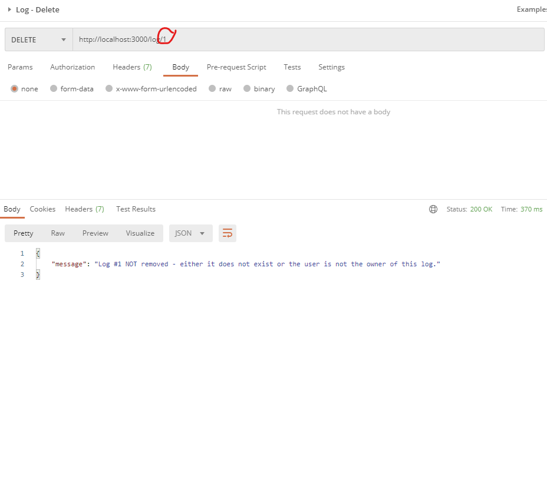
log does not exist
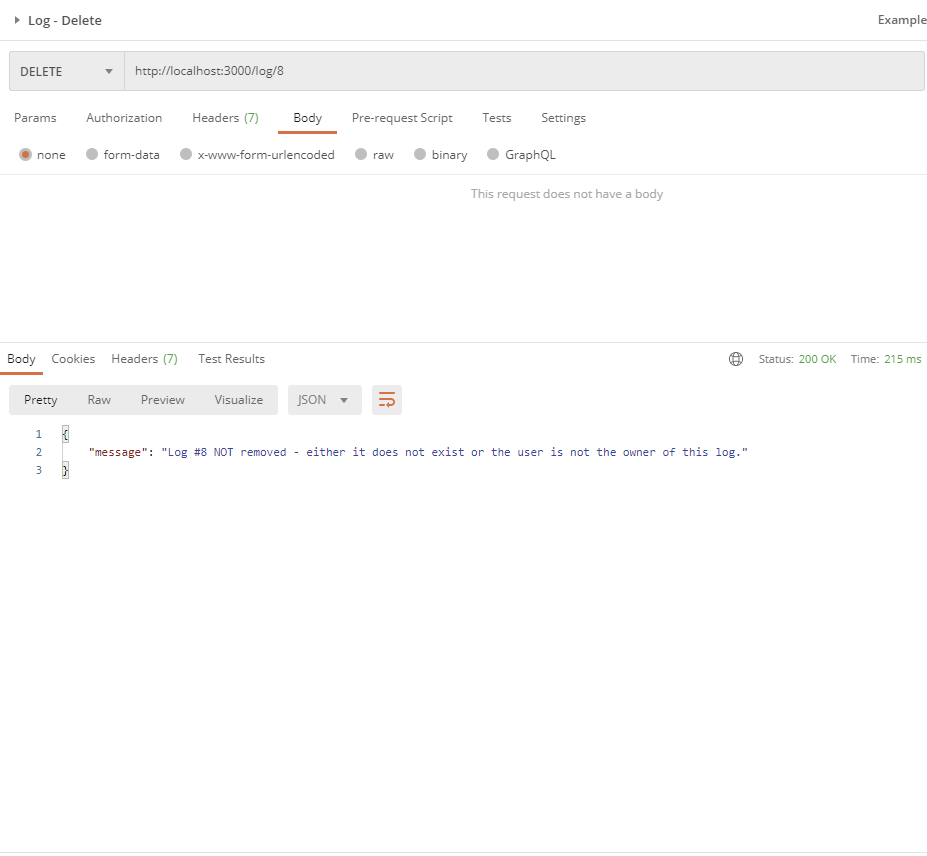
